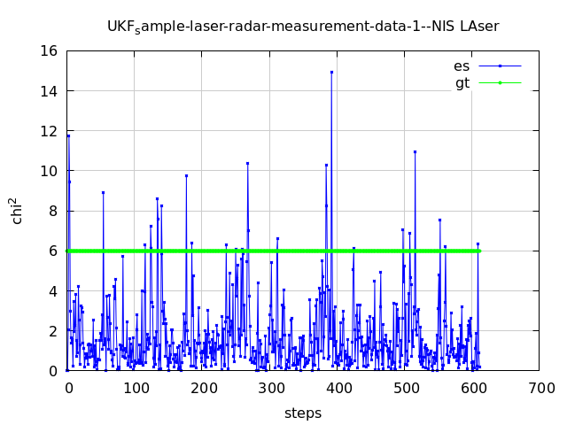
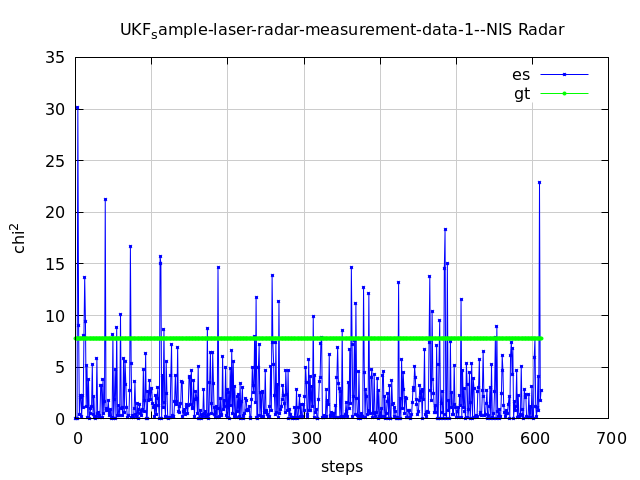
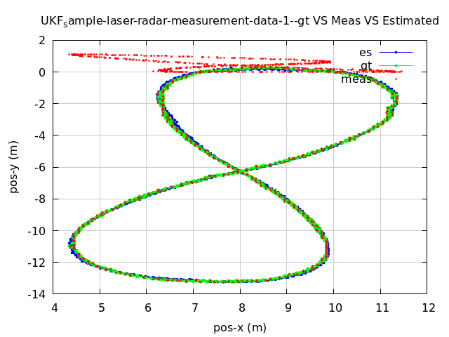
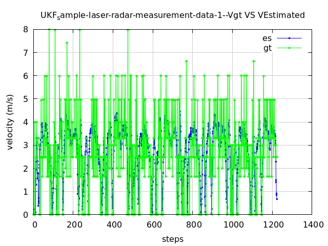
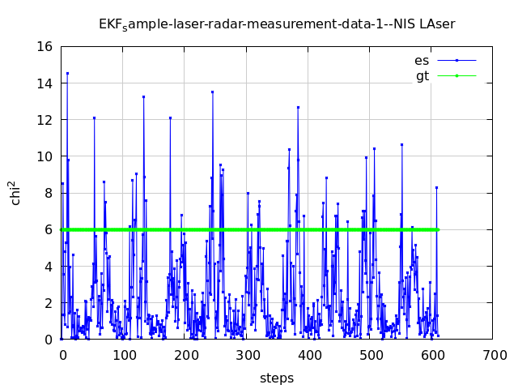
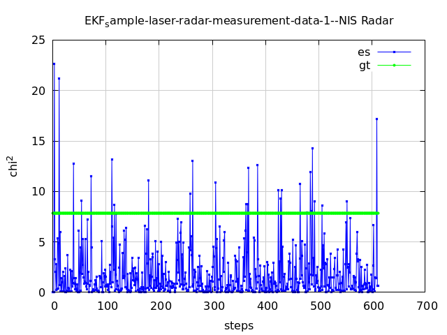
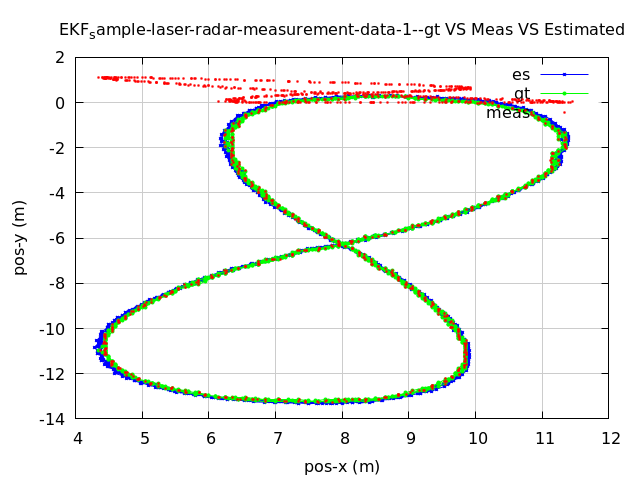
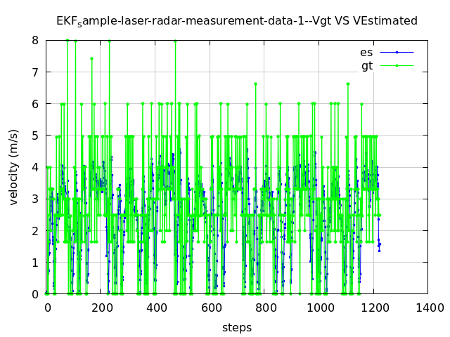
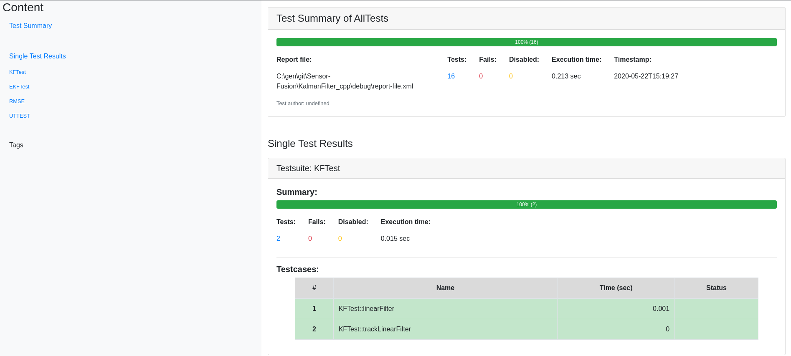
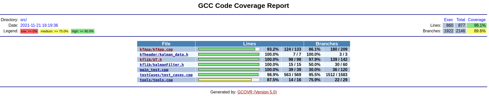

# Multi Object Tracking

---

## Other Important Dependencies
* cmake >= 3.5
  * All OSes: [click here for installation instructions](https://cmake.org/install/)
* make >= 4.1 (Linux, Mac), 3.81 (Windows)
  * Linux: make is installed by default on most Linux distros
  * Mac: [install Xcode command line tools to get make](https://developer.apple.com/xcode/features/)
  * Windows: [Click here for installation instructions](http://gnuwin32.sourceforge.net/packages/make.htm)
* gcc/g++ >= 9.0
  * Linux: gcc / g++ is installed by default on most Linux distros
  * Mac: same deal as make - [install Xcode command line tools](https://developer.apple.com/xcode/features/)
  * Windows: recommend using [MinGW](http://www.mingw.org/)
* googletest [click here for installation instructions](https://github.com/google/googletest)
* gocavr 5.0 [click here for installation instructions](https://gcovr.com/en/stable/installation.html)

### Accuracy
The output RMSE px, py, vx, vy output coordinates [0.04852,0.062393,0.366935,0.400275].
Also the NIS for both lidar and radar is consistent as shown in the following figures:

For Lidar:

For Radar:

## Project results:

### UKF results:
For Lidar:

For Radar:

Output position Estimation VS Measurements VS GT:

Output velocity Estimation VS GT:

### EkF results:
For Lidar:

For Radar:

Output position Estimation VS Measurements VS GT:

Output velocity Estimation VS GT:

## Project Quality Work:

### Test Report Generated from google-test frame work:

### Coverage Reprot Report Generated from google-test frame work:

gcovr -r . --exclude-throw-branches --html --html --html-details -o example-html-details.html

